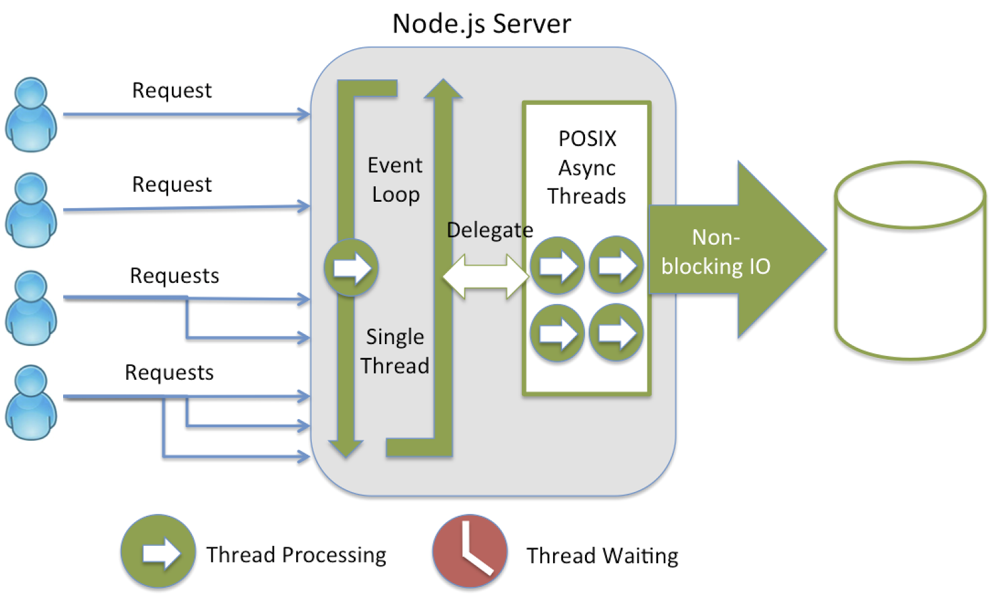

title: node.js Introduction
author:
  name: Andi Neck
  twitter: andineck
  url: http://intesso.com
controls: false
progress: true
style: style.css
output: index.html


--
# node.js introduction

> http://intesso.github.io/nodejs-introduction
--
### who uses node.js


and many more ...

--
### trend


--
### use cases

- build chain [gulp](http://gulpjs.com/), [grunt](http://gruntjs.com/): compile, lint, bundle, etc...
- website / webapp [express](http://expressjs.com/) [hapijs](http://hapijs.com/)
- backend for mobile apps
- RESTful services [restify](http://restify.com/)
- microservices [seneca](http://senecajs.org/)
- desktop applications [electron](http://electron.atom.io/)
- commandline tools [commander](https://www.npmjs.com/package/commander), [minimist](https://www.npmjs.com/package/minimist)
- messaging (TCP, UDP, http, https, ...) [node.js api](https://nodejs.org/api/)
- IoT [cyclon.js](http://cylonjs.com/)
- native c, c++ modules [addons](https://nodejs.org/api/addons.html)
- basically any I/O, Network and Web Stuff that needs parallel processing

--
### runs on
> windows, linux, mac, arm, docker ...


[go download: https://nodejs.org/en/download/](https://nodejs.org/en/download/)

--
### personal experiences with node.js

- started with v0.6
- v0.8, v0.12, v4.3 in production

> so far, I never experienced unexpected behaviour from node.js

- when something was not working the way I thought it should be, it was most of the time, because I didn't understand JavaScript well enough

--
### built with node.js at intesso

- Traffic Control System
  - Realtime UI with WebSockets (socket.io)
  - TCP/XML Interfaces
- Intelligent Charging Station
  - Communication with OSGI bundle via 0mq
  - binding with python code with zerorpc
  - SOAP WebService Interfaces
  - Proprietary Binary Interface with Charging Station
  - Admin Web UI
- [On demand Remote Access](http://intesso.com/projects/remote-access)
- Modular Content Management System: [GlintCMS](http://glintcms.com/), based on [GlintApp](https://github.com/glintapp/glintapp)
- and many Open Source `npm` Modules: [andineck](https://www.npmjs.com/~andineck)


--
### what makes node.js stand out?

- same language on the server and the browser
- excellent module system [npm](https://www.npmjs.com/)
- more than 230'000 npm modules
- quite good open source communities
- part of the linux foundation
- and there is more ...

--
### node.js thesis

> io needs to be done differently
>
> [original node.js presentation by Ryan Dahl](https://youtu.be/ztspvPYybIY?t=48)

--
### The cost of I/O

      L1-cache           3 cycles

      L2-cache          14 cycles

      RAM              250 cycles

      Disk      41'000'000 cycles

      Network  240'000'000 cycles

> don't block on I/O access

but how?

> Threads in combination with Object oriented programming can be really painful and error prone.

--
### event-loop


[source: https://strongloop.com/strongblog/node-js-performance-event-loop-monitoring/](https://strongloop.com/strongblog/node-js-performance-event-loop-monitoring/)

--
### event-loop

- your code is single threaded, basically everything else runs in parallel
- event-loop [event-loop explanation](https://nodesource.com/blog/understanding-the-nodejs-event-loop/), [ryan dahl's original presentation](https://www.youtube.com/watch?v=ztspvPYybIY), is based on `libuv`
- EventEmitter to interact with the event-loop
- EventEmitter itself is synchronous

--
### more node.js building blocks

> - node.js is built on top of google chrome V8
> - Microsoft submitted a [pull request](https://blogs.windows.com/msedgedev/2016/01/19/nodejs-chakracore-mainline/) for support with it's ChakraCore in January 2016

- [module system](https://nodejs.org/api/modules.html)
- [events](https://nodejs.org/api/events.html)
- [streams](https://nodejs.org/api/stream.html)

--
### editors

- [atom](https://atom.io/)
- [brackets](http://brackets.io/)
- [sublimetext](http://www.sublimetext.com/3)
- [vim](https://github.com/moll/vim-node)
- [WebMatrix](http://www.hanselman.com/blog/WebMatrixAndNodejsTheEasiestWayToGetStartedWithNodeOnWindows.aspx)
- [WebStorm](https://www.jetbrains.com/webstorm/download/)
- [nodeclipse](http://www.nodeclipse.org/)


--
### debugging

> [debugging node.js](http://spin.atomicobject.com/2015/09/25/debug-node-js/)

[tools for restarting node.js server automatically](https://strongloop.com/strongblog/comparison-tools-to-automate-restarting-node-js-server-after-code-changes-forever-nodemon-nodesupervisor-nodedev/)

> reload node.js server automatically with [nodemon](http://nodemon.io/) or [forever]()

--
### coding

> file server

```js
var http = require('http');
var fs = require('fs');

var server = http.createServer();

server.on('request', function (req, res) {
  if (req.url == '/favicon.ico') return res.end();
  var stream = fs.createReadStream(process.cwd() + req.url);
  stream.pipe(res);
});

server.listen(8000);
console.log('fileserver running at: http://localhost:8000');
```

--
### coding

> using EventEmitter

```js
var http = require('http');
var fs = require('fs');

var server = http.createServer();
server.on('request', function (req, res) {
  if (req.url == '/favicon.ico') return res.end();
  var stream = fs.createReadStream(process.cwd() + req.url, 'utf-8');
  stream.on('data', function(data){
    res.write('\n\ngot data: ' + data);
  });
  stream.on('error', function(err){
    res.write('\n\nshit happens' + err);
  });
  stream.on('end', function(){
    res.end('\n\ndone, no more data');
  });
});

server.listen(8000);
console.log('fileserver running at: http://localhost:8000');
```

--
### learning, learning, learning...

- node.js [api](https://nodejs.org/api/)
- web apis [devdocs](http://devdocs.io/)
- testing node.js server + npm online [tonicdev](https://tonicdev.com/)
- testing node.js browserified bundles [requirebin](http://requirebin.com/)

> get some great interacitve node.js lessons:

```sh
npm install learnyounode -g
npm install workshopper -g
npm install adventure -g
npm install functional-javascript-workshop -g
```


--
### JavaScript / ECMAScript / node.js Versions

- ES5 node.js < 0.x
- ES6 (ECMAScript 2015) io.js, node.js >= 0.x

**node.js releases**
- LTS: long term support (even numbers)
  - current release: V4 "Argon"
  - actively maintained for 18 month, maintenance mode afterwards
  - no more than two LTS versions at the same time
- Stable: shorter lifespan, more updates (odd numbers)
  - current release: V5
  - when Stable release becomes the next LTS, no new features or breaking changes are added

--
### js obstacles

> Callback Functions

```js
// dom stuff
var body = document.querySelector('body');

// event listener
body.addEventListener('click', myCallback);

function myCallback(e) {
  confirm("DONT CLICK!");
}

// same in green, but with nested function
body.addEventListener('click', function myCallback(e) {
  confirm("DONT CLICK!");
});
```

--
### js obstacles

> [Callback Hell](http://callbackhell.com/) is when your code looks like this

```js
function add(i, callback) {
  i = i+1;
  setTimeout(function(){
    console.log('count', i);
    callback(i);
  }, 100);
}

add(1, function(i){
  add(i, function(i) {
    add(i, function(i){
      add(i, function(i){
        console.log('done', i);
      });
    });
  });
});
```

**Ways out: name and reference functions, use libraries like [async](https://github.com/caolan/async), modularize**

--
### js obstacles

> Prototypal Inheritance

```js
// constructor function
function Hello (announcement) {
    if (!(this instanceof Hello)) return new Hello(announcement);
    this.announcement = announcement;
}

// method
Hello.prototype.world = function () {
    console.log(this.announcement, 'hello world');
};

// instantiating an object
var hello = Hello(); // or new Hello();
hello.world(); // prints out: hello world

// method added (on the fly)
Hello.prototype.ch = function () {
    console.log(this.announcement, 'sali duu');
};
hello.ch(); // prints out: sali duu
```

--
### js obstacles

> problem with `this`

```js
// constructor function
function Hello (announcement) {
    if (!(this instanceof Hello)) return new Hello(announcement);
    this.announcement = announcement;
}
// wrong method
Hello.prototype.world = function () {
    setTimeout(function(){
        // !!! this is `undefined` in the inner function
        console.log(this.announcement, 'hello world');
    }, 1000);
};
// correct method
Hello.prototype.world = function () {
    // save `this` to use in inner function
    var self = this;
    setTimeout(function(){
        // works as expected
        console.log(self.announcement, 'hello world');
    }, 1000);
};
Hello('I SAY:').world();

```

--
### js obstacles

> Grasp Functional Beauty

```js

function repeater (who, what) {
  var text = 'said';
  // returning the inner function creates a closure at run time
  return function repeat() {
    console.log(who, text, what);
  }
}

var i = repeater('I','hello');
var you = repeater('you','world');

i();  // I said hello
you(); // you said world

repeater('everyone', 'yay!')();  //everyone said yay!

```

--
### js obstacles

> problem with `for` loop

```js

// works as expected
for(var i = 0; i < 10; i++) {
  console.log('i', i);
  //0 1 2  ... 9
} // **only use for loop for synchronous actions**

// hmmm not really what we wanted
for(var i = 0; i < 10; i++) {
  setTimeout(function (){console.log('i', i)}, 100);
  //10 10 10  ... 10
} // **don't use for loop for asynchronous actions**
```

--
### js obstacles

> solutions to `for` loop problems

```js
// Array.forEach function
var arr = [];
for(var i = 0; i < 10; i++) {
  arr.push(i);
}
arr.forEach(function(i){
  setTimeout(function (){console.log('i', i)}, 100);
  //0 1 2  ... 9
});  // **Array.forEach works well for asynchronous actions**

// anonymous immediately invoked function
for(var i = 0; i < 10; i++) {
  (function(i){
    setTimeout(function (){console.log('i', i)}, 100);
    //0 1 2  ... 9
  })(i);
}
```

--
### js obstacles

> Variable Hoisting

*Variables can be used, before they were declared. Variable declarations (not initialization) are moved to the top of the function or global scope (hoisted). It is therefore recommended to declare the variables at the top of the function or global scope*
```js
var myvar = 'hello outer';
function myfunction () {
  console.log(myvar); // undefined
  var myvar = 'hello inner';
}
myfunction();
```
*myfunction above is equivalent to this:*
```js
function myfunction () {
  var myvar; // declaration
  console.log(myvar); // undefined
  myvar = 'hello inner'; // initializations
}
```

--
### js obstacles

> NO Block Scope

```js
var x = 'hallo';
console.log(x); // 'hallo'
if (true) { // block
	var x = 'welt'; // overwrites var x outside block
	console.log(x); // 'welt'
}
console.log(x); // 'welt'
```
**JavaScript has function scope (no block scope)**


--
### js obstacles

> but Function Scope

```js
var x = 'hallo';
console.log(x); // 'hallo'
function welt () { // function scope
    if (true) {
  	var x = 'welt'; // own declaration of x inside function
  	console.log(x); // 'welt'
  }
}
welt();
console.log(x); // 'hallo'
```
--
### js obstacles

> Function Scope, same in green

```js
var x = 'hallo';
console.log(x); // 'hallo'
(function () { // function scope
    if (true) {
  	var x = 'welt'; // own declaration of x inside function
  	console.log(x); // 'welt'
  }
})();

console.log(x); // 'hallo'
```
--
### js obstacles

> Immediately-Invoked Function Expression

```js
// functions can be declared in brackets (function(){})
// and be Immediately-Invoked with following function call ()
(function () {
  console.log('hallo welt');
})();

// this can be used to get function scope and alias names
// often used with jQuery
(function ($) {
  console.log($('body'));
}(jQuery));

```

--
### js obstacles

> NO Dynamic Scope in JavaScript

```js
function repeat (who, what) {
  var text = 'said';
  repeater(who, what);
}

function repeater(who, what) {
  console.log(who, text, what); // ReferenceError: text is not defined
}
// the repeater function wasn't defined inside the
// caller function that has the text variable defined.
repeat('I', ', hey YOU!');
```

**JavaScript does not support dynamic scope, where the variable resolution happens in the scope where the function is called at run time.**

--
### js obstacles

> Lexical Scope

```js
function whoSaysWhat (who, what) {
  var text = 'says';
  function say() { // inner function can access the outer scope
    console.log(who, text, what); // text is declared in parent function
  }
  say();
}
whoSaysWhat('elephant', 'trörööö');  // elephant says trörööö
```

**The scope of a variable is statically defined by its location in the source code (not dynamically at run time). This is called lexical scope.**

*Note: inner functions can access variables from outer functions.*

--
### js obstacles

> Closures

*"Closures are functions that refer to independent (free) variables. In other words, the function defined in the closure 'remembers' the environment in which it was created." [quote from mozilla](https://developer.mozilla.org/en/docs/Web/JavaScript/Closures)*

```js
function repeater (who, what) {
  var text = 'said';
  // inner function is returned and creates a creates closure
  // where the returned function has access to the outer scope
  // it was defined in, even after the outer function has terminated.
  return function repeat() {
    console.log(who, text, what);
  }
}
repeater('everyone', 'yay!')();  //everyone said yay!
```

--
### js obstacles

> Changing very fast, ES5, ES6, ....
>
> Hard to choose the `right` Tool
